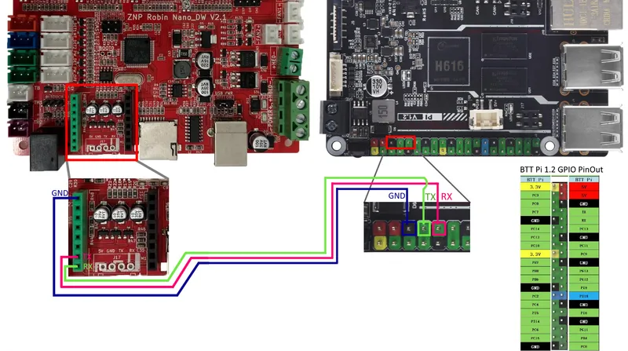
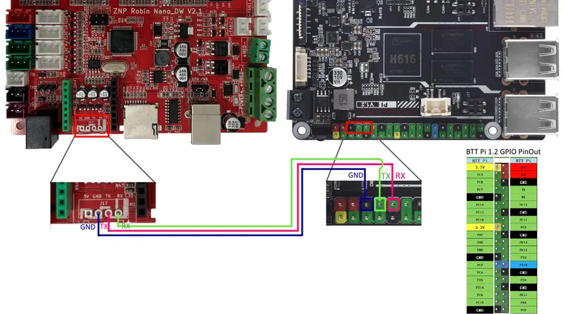
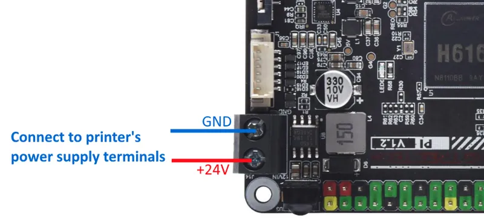
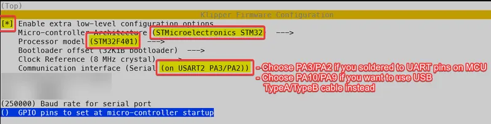
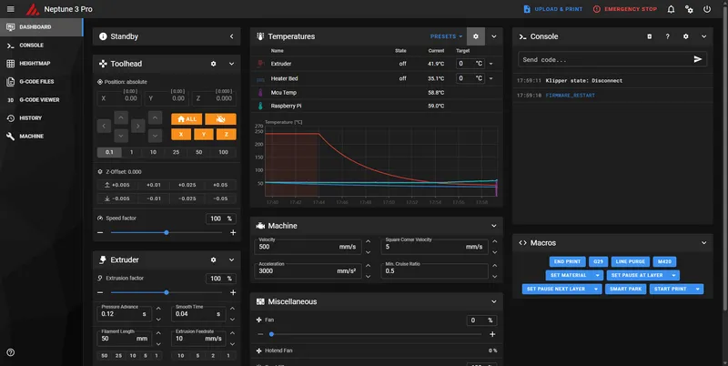



<div style="text-align:center"><a class="button" target="_blank" href="https://www.printables.com/model/841472-elegoo-neptune-3-pro-klipper-upgrade-with-btt-pi-v" rel="noopener">Download 3D model</a></div>

This page contains instructions for installing Klipper on your stock Elegoo Neptune 3 Pro and a 3D model to attach BTT Pi V1.2 inside the printer's bottom housing.

## Why Klipper?

Klipper is a 3D printer firmware that moves motion calculations from the printer's microcontroller to a more powerful computer (like the BTT Pi). This enables:
- **Higher print speeds** - More processing power allows for faster, smoother motion
- **Advanced features** - Input shaping, pressure advance, and precise calibration
- **Web interface** - Control your printer remotely via Mainsail or Fluidd
- **Better accuracy** - More precise motion calculations result in improved print quality

The trade-off is increased complexity - you're replacing simple Marlin firmware with a Linux computer running Klipper.

#### Updates

- **2025-07-14**: Added info how to connect BTT Pi to Neptune 3 Pro via UART without soldering (thanks to [@Ernest](https://www.printables.com/@_3327909) for the provided info)
- **2024-04-18**: “What you'll need” section is edited: DuPont Jumper Wires of 30cm are preferred instead of 20cm to leave some space for MCU fan.
- **2024-04-17**: Screw holes for BTT Pi reduced to D=1.78mm to hold M2 screws better

#### What you'll need

1. **1x** BIGTREETECH BTT PI V1.2 ( [aliexpress](https://aliexpress.ru/item/1005005993688772.html?sku_id=12000035235201141), “Only BTT PI V1.2” option)
2. **1x** MicroSD Card (16Gb or greater is recommended. The greater read/write speeds - the better. I am using 128GB SD card that offers 200MB/s read and 90MB/s write)
3. **3x-5x** M3 Screws (5-12mm) to screw board holder to printer's case
4. **4x** M2 Screws (5-8mm) to screw BTT Pi V1.2 to board holder
5. **2x** wires (20-30cm) to power your BTT Pi V1.2 from Printer's PSU
6. Cable ties to do some cable management
7. Cables to connect BTT Pi to MCU (see below)

**Additionally** you will need the following items depending on the MCU ←→ BTT Pi connection method:

- UART (no soldering):
  - **3x** DuPont Jumper Wires, **Male-Female** 30cm length ( [aliexpress](https://aliexpress.ru/item/1005003269498051.html?sku_id=12000028321847215), “3 x 40pin Ribbon Kit 30cm” or “40pin Ribbon M-F”)
- UART (a bit of soldering):
  - **1x** 4PIN 2.54mm Pin Header **Male** ( [aliexpress](https://aliexpress.ru/item/1005003642908658.html?sku_id=12000026620903586), “Mix Kits 20PCS”)
  - **3x** DuPont Jumper Wires, **Female-Female** 30cm length ( [aliexpress](https://aliexpress.ru/item/1005003269498051.html?sku_id=12000028321847215), “3 x 40pin Ribbon Kit 30cm” or “40pin Ribbon F-F”)
- USB type B connector on the front:
  - USB 2.0 type B cable

#### Printing BTT Pi board holder

You should print **1x Base.3mf** and **3x Stands.3mf** (you can print 4 stands to have a spare in case one breaks while mounting). Models already have some tolerance, so they should print fine on a stock calibrated Neptune 3 Pro.

<div style="text-align:center"><a class="button" target="_blank" href="https://www.printables.com/model/841472-elegoo-neptune-3-pro-klipper-upgrade-with-btt-pi-v" rel="noopener">Download 3D model</a></div>

**Print settings:**

- 0.2mm layers
- 3 top/bottom layers
- 3 wall loops
- Infill 15% Gyroid (or improved 3D Honeycomb in Orca Slicer V2.0.0+)
- No supports
- No brim
- Consider using glue stick for better adhesion (I experienced warping issues on PETG when printing the Base.3mf)

##### Assembly

After printing, attach the Stands to the Base (from the bottom side). You can glue them if they are falling out.


#### Installing Klipper on BTT Pi V1.2

You should download official Debian with pre-installed Klipper [from BTT's GitHub here](https://github.com/bigtreetech/CB1/releases) (file is named something like `CB1_Debian11_Klipper_XXXXX.img.xz`) and flash it on a MicroSD card using a tool like [Balena Etcher](https://etcher.balena.io/).

After flashing the OS, open the SD card in your file explorer and modify two files using Notepad:

**1. system.cfg**: change your WiFi SSID and password.

```ini
...
###########################################
# wifi name
WIFI_SSID="ZYIPTest"
# wifi password
WIFI_PASSWD="12345678"
...
```

**2. BoardEnv.txt**: You need to free the TTY for MCU connection (by default, Debian uses it for console). Replace `console=display` with `console=serial` and save this file.

```ini
...
## default 'display' for debug, 'serial' for /dev/ttyS0
# console=display
console=serial
...
```

> **Technical Note**: The BTT Pi uses a serial port (TTY) to communicate with the printer's MCU. By default, Debian uses this port for console debugging output. Setting `console=serial` redirects debug output elsewhere, freeing the TTY for printer communication.

#### Connecting BTT Pi V1.2 to Printer's MCU

There are three main methods to connect the MCU to the BTT Pi:

- UART (no soldering) method
- UART (a bit of soldering) method
- USB method

**Which connection method should you choose?**

| Method | Pros | Cons | Best for |
|--------|------|------|----------|
| **UART (no soldering)** | No modifications needed, reliable | - | Most users |
| **UART (soldering)** | - | Requires soldering skills | Deprecated method |
| **USB** | Very simple, plug-and-play | Cable visible on front | Quick testing |

**Recommended**: UART without soldering - it's the most convenient and doesn't require modifications to your printer.

##### Option 1: UART connection without soldering

> Thanks to [@Ernest](https://www.printables.com/@_3327909) for pointing out this soldering-less method. [More information is available here](https://github.com/Arm0ID/Klipper_to_Elegoo_Neptune_UART_RU/tree/main).

To connect the printer's MCU to BTT Pi V1.2 using UART without soldering, use the internal BTT Pi GPIO according to this wiring scheme:



| Printer's MCU | BTT Pi |
| ------------- | ------ |
| GND           | GND    |
| RX            | TX     |
| TX            | RX     |

##### Option 2: UART connection with a bit of soldering

> It's preferred to use solderless method of UART connection to avoid useless hassle, see [Option 1](#option-1-uart-connection-without-soldering).
>
> This method with soldering doesn't have any meaningful advantages over solder-less method, but it was my original way of connecting BTT Pi to MCU, so I am leaving it here for the future adventurers.

To connect the printer's MCU to BTT Pi V1.2 using UART with a bit of soldering, use the internal BTT Pi GPIO according to this wiring scheme:



| Printer's MCU | BTT Pi |
| ------------- | ------ |
| GND           | GND    |
| RX            | TX     |
| TX            | RX     |

To make this connection detachable, solder a male or female **4PIN 2.54mm Header** to the 4 pins on the ZNP Robin Nano shown in the picture above. Then attach these pins with the corresponding DuPont jumper wires.

##### Option 3: USB mode connection

Use a USB Type-B cable attached to the BTT Pi's USB port and the printer's Type-B port on the front panel.

#### Powering BTT Pi V1.2

Next, connect the BTT Pi V1.2 to the printer's PSU terminals. The Elegoo Neptune 3 Pro has three **24V** ("+" and "-") terminals. One is already attached to the ZNP Robin Nano_DW MCU, and two others are spare. You can use them to power your BTT Pi V1.2. My printer works perfectly with the printer's PSU, but if the power supply seems unstable, consider using a +5V USB Power Adapter and connect it to the BTT Pi with a USB Type-C cable.

> ⚠️ **CRITICAL SAFETY WARNING**
> - BTT Pi operates at **DC 12-24V** from power terminals OR at **DC 5V** from USB only
> - **NEVER** connect AC voltage (110V/220V) directly to the BTT Pi
> - **NEVER** power the BTT Pi from both PSU (24V) and USB (5V) simultaneously
> - Double-check the voltage marked on your printer's PSU terminals before connecting
> - Incorrect voltage **will permanently damage** your BTT Pi



#### Flashing the printer

Power on your printer and wait for it to connect to your WiFi network. Then open your WiFi router's admin panel and search for the IP address of the BTT Pi board. It is recommended to set a fixed IP address for your BTT Pi here, so you always know how to connect to your printer. Check your router manual for instructions on how to do this.

For example, my BTT Pi has the following IP: 192.168.54.42.

Connect to the BTT Pi via SSH client (e.g., Putty) using the login/password: **biqu** / **biqu**.

Enter the following commands in the terminal:

```bash
cd klipper
make menuconfig
```

Choose settings as shown in the following screenshot:

1. Enable "Enable extra low-level configuration options" (`[*]`) (otherwise you won't see the PA3/PA2 option later)
2. Set "Micro-controller Architecture" to "STMicroelectronics STM32"
3. Set "Processor model" to "STM32F401"
4. Set "Communication interface":
5. For **UART** connection mode choose "**PA3/PA2**"
6. For **USB** connection mode choose "**PA10/PA9**"



Press "**Q**" on your keyboard and confirm to save your settings.

Build your firmware with the following command:

```bash
make
```

After building the firmware, connect to your BTT Pi using WinSCP and navigate to the following folder: `/home/biqu/klipper/out`

Format a separate SD card to **FAT32** and copy `klipper.bin` from the BTT Pi to its root directory. Rename this file to `ZNP_ROBIN_NANO.bin`, then safely eject your SD card and insert it into the printer's SD card slot. Restart the printer and wait approximately 3 minutes for flashing to complete. The Elegoo screen will not show upgrade progress - this is normal. Klipper doesn't support the stock Elegoo screen out of the box, but you can search for custom projects later if you want to restore screen functionality.

> **Note about the Elegoo screen**: After flashing Klipper, your printer's touchscreen will go blank. This is normal - Klipper doesn't support the stock Elegoo screen out of the box. You'll control the printer via the web interface (Mainsail/Fluidd) instead. See the "Using your Elegoo screen with Klipper" section at the end for options to restore screen functionality.

#### Configuring Klipper

After waiting approximately 3 minutes for flashing to complete, eject the SD card from the printer and restart it. Open your BTT Pi's IP address in the browser (e.g., `http://192.168.54.42` in my case - your IP will be different) and go to the **Machine** section on the sidebar.

Open the file named **printer.cfg**, erase it completely, and insert [TheFeralEngineer's config](https://github.com/TheFeralEngineer/Klipper-for-Elegoo-Neptune-series-3D-Printers/blob/main/Neptune%203%20Pro%20config/printer.cfg) in this file. You can also find [many videos from TheFeralEngineer](https://www.youtube.com/@TheFeralEngineer) on YouTube that explain how to configure Klipper and set it up on Elegoo printers.

Change serial port in the file:

```ini
[mcu]
# If printer is connected to the BTT Pi's GPIO, use /dev/ttyS0
# If printer is connected to the BTT Pi's USB port, try /dev/ttyUSB0
# or /dev/ttyACM0
serial: /dev/ttyS0
```

Then press **Save & Restart** button and your printer should be detected by the Klipper.

You should see something like this on the Dashboard tab:




If you see errors like these, it means Klipper could not connect to the printer using UART.

**You can try the following:**

- **Change the serial port in the `printer.cfg` file.**

You can find the list of available UART ports on your BTT Pi using the following command (enter it in an SSH terminal, e.g., Putty): `ls /dev/ttyS0 /dev/ttyUSB* /dev/ttyACM* /dev/serial/by-id/*`. In my case, only /dev/ttyS0 was found, but if you are using USB or a USB-to-TTL connector, your results may differ.

- **Check UART wiring.** RX should be connected to TX and vice versa.
- **Check the UART cable length.** Your wires should not be too long as they may be affected by electromagnetic interference.
- **Check that your BTT Pi is not using the internal UART port on GPIO for its own purposes.** Verify that you changed the `BoardEnv.txt` file to set `console=serial` instead of `console=display`.

**Additional troubleshooting steps:**

- **Verify BTT Pi is booting properly**: Check if the BTT Pi's green LED is lit and the network activity LED is blinking
- **Check WiFi connection**: SSH into the BTT Pi to confirm it's connected to your network
- **Test UART communication**: Run `ls -l /dev/ttyS0` in SSH to verify the serial port exists
- **Review Klipper logs**: In the Mainsail/Fluidd interface, check the Klippy log for detailed error messages
- **Verify firmware was flashed**: Remove the SD card from the printer and check if `ZNP_ROBIN_NANO.bin` was renamed to `ZNP_ROBIN_NANO.CUR` (indicates successful flash)

#### Slicer configuration

You can use default Elegoo Neptune 3 Pro profile in your slicer and change **G-Code flavor** from **Marlin** to **Klipper**. Also, disable any **Linear Advance**/ **Pressure Advance** in your slicer and calibrate it on Klipper.

#### Printer calibration

After Klipper detects your printer, you should calibrate it to work properly. For detailed calibration instructions, follow these guides:

1. [Configuration checks - Klipper documentation](https://www.klipper3d.org/Config_checks.html) (also check out other sections - Bed Leveling, Resonance compensation and etc)
2. [Ellis’ Print Tuning Guide](https://ellis3dp.com/Print-Tuning-Guide/)
3. I also reduced `max_velocity` from 500 to 270 otherwise my printer had some weird noise when I moved Y (bed) axis. You can check if your printer has this noise by using the following commands after homing: `G1 Y0 F21000` and `G1 Y120 F21000`. These commands move your bed to Y=0 and to Y=120 with a maximum speed that your printer allows (this speed is capped by _max_velocity_ in printer.cfg).

#### Another good addons worth checking out

1. Set up your START_PRINT/END_PRINT macros. This way you can change your Start/End G-Code without re-slicing your models.
   - [klipper/config/sample-macros.cfg](https://github.com/Klipper3d/klipper/blob/master/config/sample-macros.cfg) \- add this macro to your printer.cfg
   - [How to use this macro in your slicer](https://www.klipper3d.org/Slicers.html?h=macros#start_print-macros)
2. [kyleisah/Klipper-Adaptive-Meshing-Purging: A unique leveling solution for Klipper-enabled 3D printers!](https://github.com/kyleisah/Klipper-Adaptive-Meshing-Purging)
3. Using your Elegoo screen with Klipper
   - [Full-featured variant by joakimtoe, requires soldering](https://www.reddit.com/r/ElegooNeptune3/comments/19dvjai/neptune_3_pro_lcd_touch_screen_with_klipper/)
   - [Variant by E4ST2W3ST with reduced screen feature set, but allows to using stock screen port on your printer](https://github.com/Klipper3d/klipper/pull/6444)

#### Have any questions?

Go to the [comments section](https://www.printables.com/model/841472-elegoo-neptune-3-pro-klipper-upgrade-with-btt-pi-v/comments) on my model page and feel free to ask!
