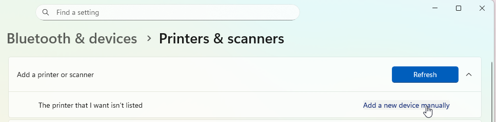
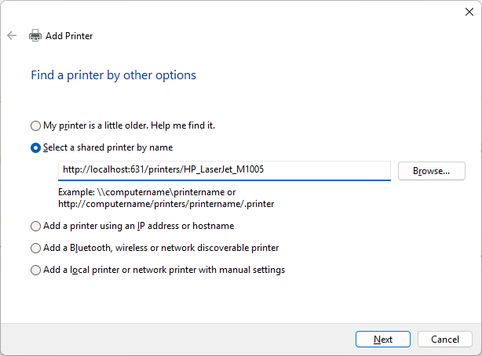
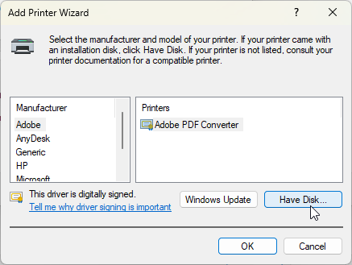
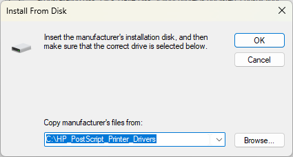
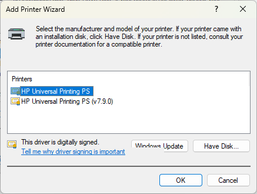
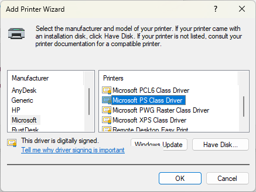



## First attempt - naive setup

OpenWRT Wiki [has a great article](https://openwrt.org/docs/guide-user/services/print_server/p910nd.server) about print servers. This article describes how to setup **p910nd** daemon on the router and how to connect our client device to it.

The guide also covers how to find a firmware for the printer and how to upload it using `hotplug.d`. My printer (HP LaserJet M1005) luckily doesn't need any firmware upload.

> **Note**: While the M1005 doesn't require firmware upload to the printer's RAM (like the HP LaserJet 1020), it is a **host-based printer** that requires the proprietary HPLIP plugin on the computer to render pages before sending them to the printer. This is important for understanding why the raw p910nd approach failed initially.


### Setting up p910nd daemon on the router
> Spoiler: this setup didn't work for me

Firstly, you should install **p910nd** and USB kernel modules on your router:
```bash
root@router:~# opkg update

root@router:~# opkg install kmod-usb-printer kmod-lp p910nd luci-app-p9
```

Then I configured p910nd through the web interface of my router like this in *Services -> p910nd Printer Server* section:




As a result, the complete configuration file looks like this:
```properties
# /etc/config/p910nd

config hotplug
        option driver_home '/opt/p910nd_drivers'

config p910nd
        option enabled '1'
        option device '/dev/usb/lp0'
        option port '1'
        option bind '192.168.55.1'
        option usbvidpid '03f0/3b17'
        option mdns_sn 'KJ1QBA7'
        option bidirectional '1'
        option mdns_cls 'PRINTER'
        option mdns_mfg 'Hewlett-Packard'
        option mdns_note 'Located near router'
        option mdns '1'
        option mdns_mdl 'HP LaserJet M1005'
        option mdns_cmd 'ACL'
        option mdns_ty 'HP LaserJet M1005'
        option mdns_product '(HP LaserJet M1005)'
```

Then I had to add firewall rule to allow incoming request to TCP port 9101 like this:


I restarted the service using `service p910nd restart`, and re-plugged my printer and saw the following lines in the router logs:
```
Sat Jan 10 11:28:12 2026 daemon.info p910nd hotplug: No driver file: /opt/p910nd_drivers/Hewlett-Packard_HP_LaserJet_M1005_03f0_3b17.bin for /dev/usb/lp0 [ 03f0/3b17 ] (upload it if your printer needs a driver loading).
Sat Jan 10 11:28:12 2026 daemon.info p910nd hotplug: (Re)starting p910nd
```

### Configuring Windows client

Then I set up my printer on the Windows 11 machine like it was described on the [OpenWRT wiki page](https://openwrt.org/docs/guide-user/services/print_server/p910nd.server):
> -  Click on the Start button and select Devices and Printers.
> -  Click on “Add a printer.”
> -  In the Add Printer dialog select “Add a local printer.”
> -  Select “Create a new port:” and set the type of port to “Standard TCP/IP Port”. Then click Next.
> - In the “Hostname or IP address:” field enter the IP address of your router.
> - The “Port name:” field may be set to something you like.
> - De-select “Query the printer and automatically select the driver to use,” then click next.
> - The computer will then attempt to detect the TCP/IP port. This will take some time and will most likely fail. Failing this step is not a problem.
> - On the “Additional port information required” page set the device type to Custom and click “Settings...”
> - Verify the Printer Name or IP Address. The Protocol should be set to "Raw" and the Raw Settings Port Number should be `9101` (or whichever port you specified). Leave LPR Settings and SNMP Status Enabled empty or de-selected. Then click OK.
> - Select the correct printer driver and click next. You may need to install drivers if they are not already available.
> - Finish the remaining printer installation wizard steps as needed. The printer should now be installed and working!

The result? It worked briefly, then failed. I successfully printed one test page, but then my printer stopped responding and all subsequent print jobs failed.

## Attempt #2 - compiling CUPS

Long story short: it is a hassle to compile CUPS for the OpenWRT. There are many CUPS versions (2.x works with cups-filters, 3.x has completely different architecture and requires Printing Applications instead of drivers). I successfully compiled CUPS for my **GL.iNet Flint 2 (MT6000)** router, but it wasn't enough:
* PDF-XChange printed successfully, but Google Chrome was not printing
* Files with unicode in filenames or with long names did not print due to bugs in the outdated CUPS 2.x version that I compiled
* I did not succeed in installing drivers on the router itself, so I still had to install the printer driver on the client machines

## Attempt #3 - Hybrid approach

After [tinkering with OpenWRT compilation](https://github.com/maksimkurb/openwrt-builder) for several days, I understood the following:
* `p910nd` print server is just a raw USB-to-TCP socket for my printer. It doesn't know how to communicate with the printer and reads RAW signals.
  * `p910nd` is available for my router from official OpenWRT repos, no compilation hassle
* `CUPS`, on the other hand, knows how to communicate with my printer. It requires drivers which I can install on my Linux machine, and I can work with my printer from any client without needing to install drivers on them (any generic PostScript driver is enough).
* I have a Windows client with WSL (Windows Subsystem for Linux) installed

Then I got an idea: _**Why not install CUPS directly on my Windows client and point it to the p910nd raw socket on the router?**_

And I could!

Here's what I did:

### How This Hybrid Approach Works

The data flow for this setup is:

**Windows App** → **HP Universal PS Driver** (generates PostScript) → **WSL CUPS** (converts PostScript to HP Printer Language using HPLIP) → **Network (Raw Socket)** → **Router (p910nd)** → **USB Cable** → **Printer**

This approach works because:
- CUPS on WSL handles the printer-specific translation using HPLIP drivers
- Windows only needs to send generic PostScript, which any application can generate
- The p910nd daemon on the router simply forwards the pre-processed data to the USB printer

### 1. Setting up p910nd daemon on the router
This process is [the same as in my first attempt](#setting-up-p910nd-daemon-on-the-router), no differences at all.

### 2. Setting up CUPS on my WSL
I have WSL 2 installed on my Windows PC with Ubuntu 24.04. I don't want to describe the process of how to install it here; you can find [good guides](https://documentation.ubuntu.com/wsl/stable/howto/install-ubuntu-wsl2/) on the Internet.

Then I installed CUPS and printer drivers from Ubuntu repositories:
```bash
max@max-pc:~$ sudo apt update

# Installing CUPS
max@max-pc:~$ sudo apt install cups

# Adding CUPS to autostart
max@max-pc:~$ sudo systemctl enable --now cups

# Installing universal drivers for HP printers
max@max-pc:~$ sudo apt install hplip

# Adding user 'max' to the lpadmin group for CUPS management
max@max-pc:~$ sudo usermod -aG lpadmin max

# Installing proprietary HP drivers (follow the instructions of this wizard)
max@max-pc:~$ sudo hp-plugin -i
```

> **WSL Networking Note**: This setup uses `localhost` to access CUPS, which is stable across reboots. If you were to use the WSL LAN IP address instead, you'd need to update the Windows printer configuration after each reboot since WSL 2 assigns dynamic IP addresses. Using `localhost` ensures Windows correctly forwards port 631 to WSL 2 automatically.
>
> **Firewall Consideration**: If you have the Ubuntu firewall (`ufw`) enabled inside WSL, you may need to allow port 631. However, it's typically disabled by default in WSL installations.

### 3. Adding printer to CUPS

I went to the CUPS administation page ([http://localhost:631/](http://localhost:631)) and added my printer:



Then I provided `socket://192.168.55.1:9101` as the connection URL to point my CUPS to the p910nd socket.


I used `HP_LaserJet_M1005` as my printer name and checked the box to share this printer.


On the next steps, I chose `HP` manufacturer and `HP LaserJet m1005, hpcups 3.21.12, requires proprietary plugin` driver for my printer and clicked **Add Printer**.

Once the printer was created, I could copy the URL from my browser and use it to configure my Windows client.
In my case, the URL was `http://localhost:631/printers/HP_LaserJet_M1005`.


### 4. Adding printer to Windows Client

As I already installed **hplip** drivers on my CUPS server in WSL, I did not need to install these drivers again on my Windows client. Any generic PostScript (PS) driver should work fine.

So I downloaded [HP Universal Print Driver for Windows - Postscript](https://support.hp.com/us-en/drivers/hp-universal-print-driver-series-for-windows/model/503550), extracted it into a folder, and added my printer using these steps:

1. Open **Settings**
2. Go to **Bluetooth & Devices** -> **Printers & Scanners**
3. Click **Add device** and wait a bit until app shows "The printer that I want isn't listed" row
4. Click **Add a new device manually**
  
5. In the dialog select **Select a shared printer by name** and enter CUPS URL to the printer (`http://localhost:631/printers/HP_LaserJet_M1005` in my case), click **Next**
  
6. On the driver selection page click **Have Disk** button
  
7. Enter path to your unpacked PostScript drivers and click **OK**
  
8. Select your PostScript driver and finish printer setup.
  

    > If your printer manufacturer doesn't provide separate PostScript drivers, you can try selecting **Microsoft PS Class Driver** or try any driver from your manufacturer that has `PS` (PostScript) in its name:
    > 
    > If that doesn't work, try using the standard (non-PostScript) driver for your printer. However, if you do that, the CUPS translation layer becomes redundant, and you could skip installing drivers in WSL.
    

9. You're done! Printer is added and you can print test page.

Keep in mind that after Windows reboot you should start your WSL instance to boot CUPS server, otherwise printer wouldn't work.

## Troubleshooting

### Printer not responding after Windows reboot
Ensure your WSL instance is running. You can start it by opening a WSL terminal or running:
```powershell
wsl -d Ubuntu
```

### CUPS service not starting in WSL
Check the service status:
```bash
sudo systemctl status cups
```

If it's not running, start it manually:
```bash
sudo systemctl start cups
```

### Why use PostScript drivers on Windows?
PostScript is a device-independent page description language. By using PS drivers on Windows:
1. Windows applications generate standardized PostScript output
2. CUPS on WSL translates this PostScript to the printer's native language (PCL/PJL for HP)
3. This decouples Windows from needing printer-specific drivers

If you use non-PS drivers, Windows would need the exact printer drivers, defeating the purpose of having CUPS handle the translation.
